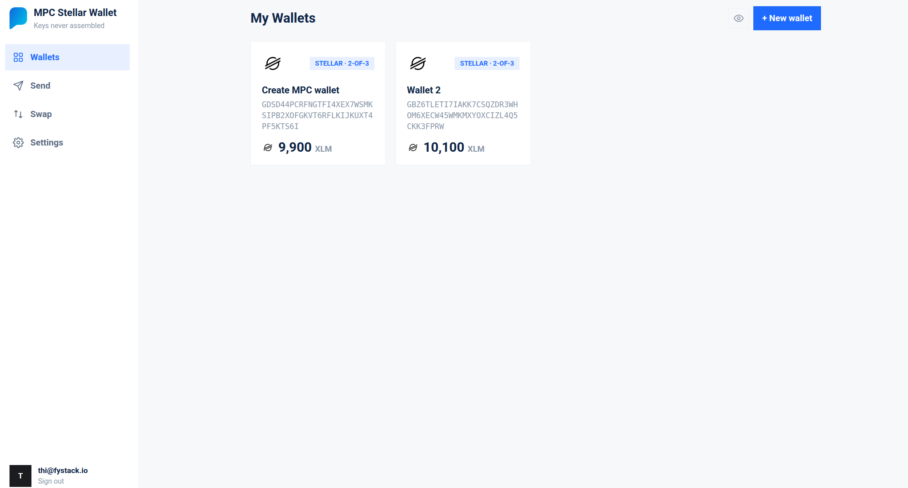
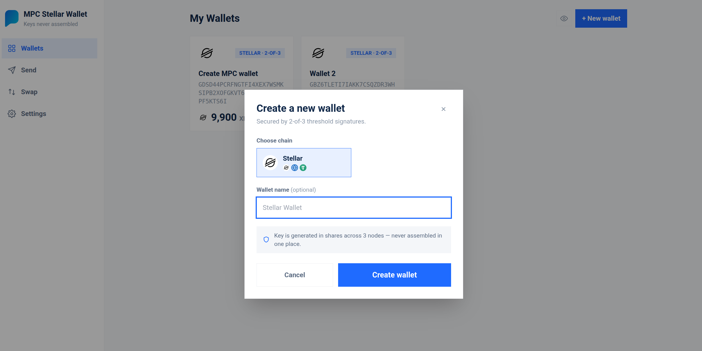
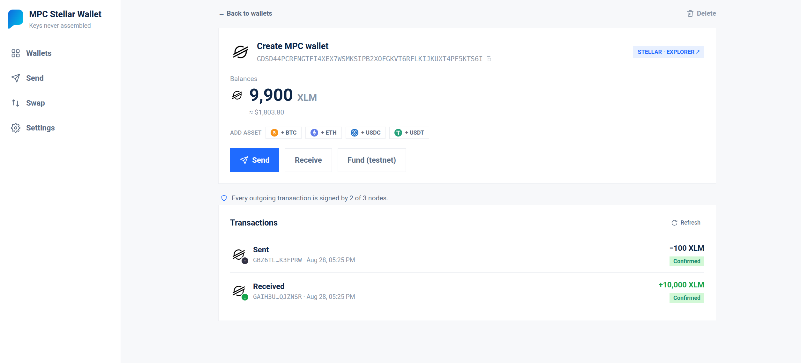
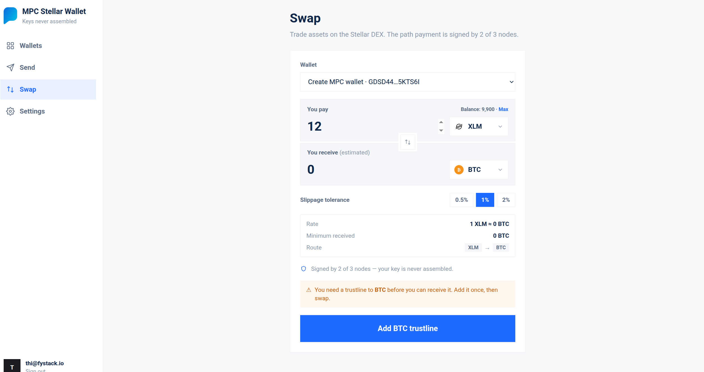

# Stellar MPC Wallet

A threshold-signature (2-of-3 MPC) wallet for Stellar, powered by the
[mpcium](https://github.com/fystack/mpcium) signing cluster. The private key is
generated in shares across 3 nodes and **never assembled** — every transaction
is signed by 2 of 3 nodes.

> ⚠️ **Unaudited — testnet only.** This code has not been security-audited.
> It targets the Stellar **testnet** and is intended for experimentation and
> development only. Do not use it with mainnet funds or in production. Use at
> your own risk.

## Screenshots

| | |
|---|---|
|  |  |
|  |  |

```
stellar-wallet/
├── backend/              # Go (Gin) API — links to the cluster over NATS, builds/broadcasts txs
├── ui/                   # Vite + React + Tailwind frontend
├── mpcium/               # generated node identities + keys (git-ignored, mounted into nodes)
├── infra/                # mpcium node config for the Docker stack
├── scripts/gen-keys.sh   # generates identities/peers/initiator key (idempotent)
├── docker-compose.yaml   # full stack: NATS + Consul + 3 nodes + backend + UI
├── start.sh / stop.sh    # one-command up / down for the whole stack
```

## Run (one command)

Generates the mpcium keys if missing, then builds & starts NATS + Consul + the
3 mpcium nodes + backend + UI — even on a fresh clone:

```bash
./start.sh            # up (generates keys on first run)
./start.sh --fresh    # wipe volumes + regenerate keys, clean start
```

Open **http://localhost:8080**, register, and create a wallet. That's it.

- UI on **:8080** (nginx; proxies `/api` + SSE to the backend, so single-origin)
- Only **:8080** is published on all interfaces. mpcium node health is on
  **:8091–8093** bound to `127.0.0.1` (local debugging); backend, Consul and
  NATS stay on the internal compose network — reach them via `docker compose exec`
- On first run `scripts/gen-keys.sh` generates node identities, `peers.json` and
  the event-initiator key into `mpcium/` (git-ignored) via the official
  `mpcium-cli` image, and injects the initiator pubkey into the node config.
- Consul runs in dev mode; each node seeds its peer IDs on startup (`--peers`).
- Key-shares live in per-node Docker volumes; wallet DB in `backend_data`.

```bash
./stop.sh             # stop (volumes kept: wallet DB + key-shares)
./stop.sh --all       # stop + remove volumes (wipe everything)
docker compose logs -f backend
```

Requires **Docker** + Compose. If the daemon isn't running, start it first
(e.g. `colima start`); if a Go build OOMs, give the VM more RAM
(`colima start --cpu 4 --memory 8`).

## Prerequisites

- **Docker** + Compose (that's all for the one-command path).

## Configuration

The Docker stack reads its settings from `backend/config.docker.yaml` (backend)
and `infra/mpcium.docker.yaml` (nodes) — nats/consul service names, node health
URL, chain code, etc. `scripts/gen-keys.sh` fills in the event-initiator pubkey.
The non-Docker backend uses `backend/config.yaml`.

The Stellar Horizon RPC endpoint is editable at runtime in **Settings → Chains & RPC**.

## What works

- **Keygen** — real distributed MPC keygen; Stellar (`G…`) address derived from the EdDSA pubkey.
- **Send** — builds a Stellar payment / createAccount, signs via the cluster, broadcasts to Horizon (testnet). Address + balance validation, fee estimate, memo on-chain.
- **Swap** — strict-send path payment on the Stellar DEX with a quote + slippage guard, signed via the cluster.
- **Receive** — QR + polls Horizon for incoming payments.
- **Balances** — live per-asset, cached with a background refresher, USD values (CoinGecko).
- **Custom assets** — register an asset (code+issuer) in Settings, add a trustline per wallet.
- **Cluster health** — real node liveness via each node's `/health`; RPC status checks.
- Live updates over SSE, hash routing (deep-links / reload-safe), toasts.

## Notes / limits

- **Testnet only** — Horizon testnet + Friendbot. Mainnet not enabled.
- Dev auth (hardcoded JWT secret). Harden (env secret, HTTPS, rate-limit) before any real deployment.

## Backend API (`/api/v1`)

`auth/register`, `auth/login`, `wallets` (CRUD), `wallets/:id/{balance,fund,sync,trustline,transactions,swap,swap/quote}`,
`transactions`, `tx/:hash/chain`, `resolve`, `events` (SSE), `cluster`, `chains`, `prices`, `config`, `assets`.

## License

Licensed under the [Apache License, Version 2.0](LICENSE). See [NOTICE](NOTICE)
for attribution.
